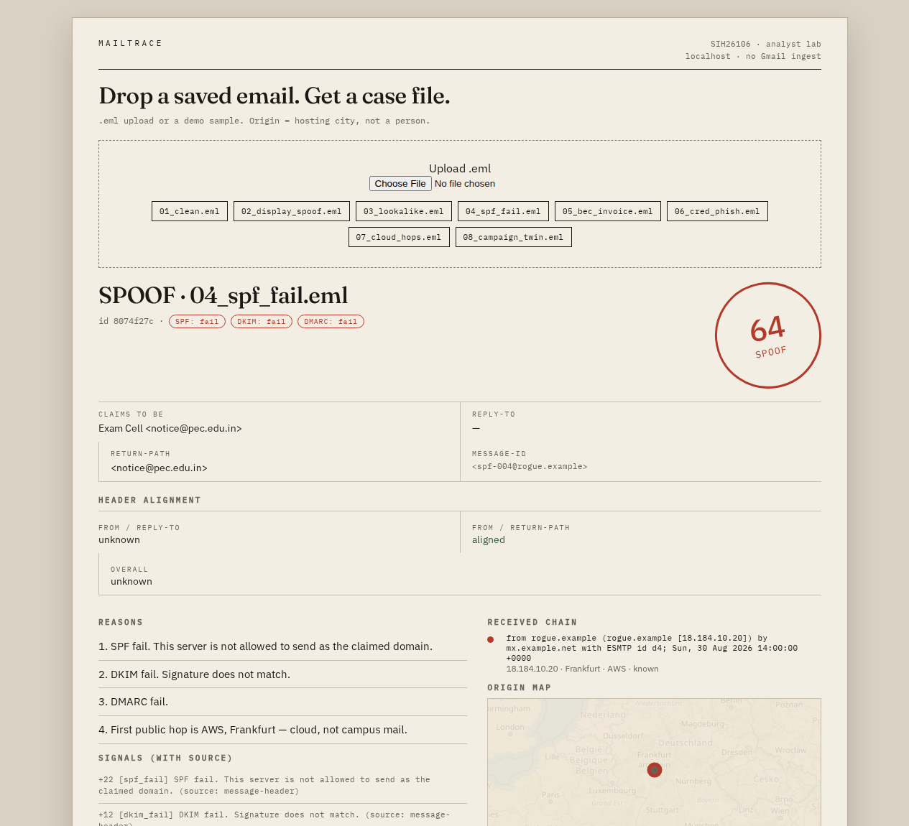
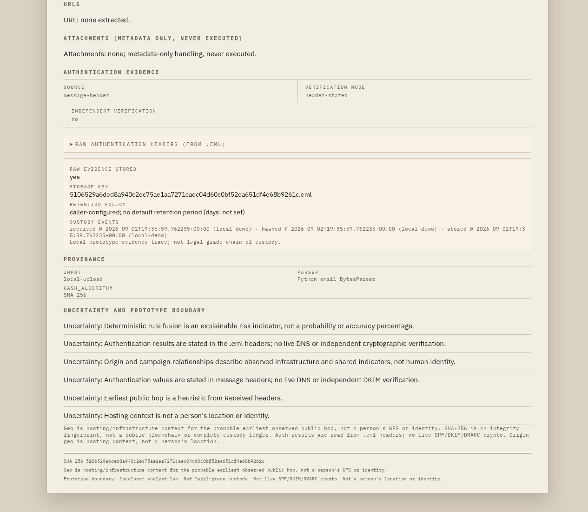

# MailTrace — Complete Noob-Friendly Guide (SIH26106)

> If you know nothing about email security, start here. This one file explains what we built, why, how it works, what language we used, what every hard word means, and what the screenshots prove.

**Repo:** https://github.com/nexurlabs/sih
**Live full build (private):** https://nexurlabs.com/mailtrace-private/
**Run locally:** `uvicorn app:app --host 127.0.0.1 --port 8777` then open http://127.0.0.1:8777

---

## 1. What is MailTrace in one minute?

MailTrace is a **detective table for suspicious emails**.

You give it a saved email file (`.eml`). It tells you:

1. **Is it shady?** — score 0-100 + label: `CLEAN`, `SPOOF`, `PHISH`, or `BEC`
2. **Why?** — plain reasons like "SPF fail", "Reply-To does not match From"
3. **Where did it travel?** — the `Received` hop chain + probable first public hop
4. **Is it part of a campaign?** — graph linking emails with same Reply-To / domain / hop
5. **Proof?** — SHA-256 hashed evidence + downloadable PDF case file

It is **not** Gmail. It does not read your inbox. It does not send phishing. It does not track humans.

Think: **post-mortem lab, not spam filter.**

---

## 2. Why did we build this?

Problem statement **SIH26106** basically asks:

> "Anyone can fake an email. Help an investigator prove it, explain it, and link related attacks."

Real pain:

- A student gets "Exam Cell <notice@pec.edu.in>" but it actually came from `rogue.example`. Fees / passwords get stolen.
- A "vendor" sends "new bank account, wire urgently" — that's BEC, crores lost in India every year.
- Normal spam filters just say "spam / not spam". They don't show **why**, **where it came from**, or **whether 5 other mails are the same gang**.

So we built an **explainable, offline-first analyst lab** that a college team can demo on a laptop with zero Gmail access.

---

## 3. What it is NOT (important for judges)

- Not a spam/ham ML classifier
- Not Gmail / Outlook integration
- Not a human tracker — Geo = **server city / ISP**, never a person's GPS
- Not a DKIM signature verifier — we read header stamps + live SPF/DMARC TXT, we don't do crypto verification
- Not a legal chain-of-custody tool, not attacker attribution
- Score is a **risk indicator**, not a probability, not "64% accurate"

We say this openly in the UI and PDF. That's honesty, not weakness.

---

## 4. How to use it in 30 seconds

1. Open the app. You see sample emails on the left.
2. Click `04_spf_fail.eml` → you get `64 / SPOOF` with reasons.
3. Click `07_cloud_hops.eml` then `08_campaign_twin.eml` → graph shows **2 nodes, 1 edge** (twins linked).
4. Click any case → Evidence, Headers, Hops, Graph, PDF download.
5. Upload your own `.eml` (private build only) → same pipeline runs.

No login in local mode. Private hosted mode uses the existing NexURLabs login.

### Screenshots of it actually working

Landing + sample list:


SPF-fail case scored SPOOF:


Campaign graph linking the twins:


Case header + evidence view:





Qwen advisory (helper text, never changes score):


PDF report export:


Mobile view (works on phone browser):


Graph close-up:


All 8 fixtures score like this today:

| file | score | label | what it teaches |
|---|---|---|---|
| 01_clean.eml | 8 | CLEAN | normal mail, aligned auth |
| 02_display_spoof.eml | 100 | SPOOF | Gmail wearing official title |
| 03_lookalike.eml | 98 | PHISH | paypa1-style lookalike + login lure |
| 04_spf_fail.eml | 64 | SPOOF | server not allowed to send as pec.edu.in |
| 05_bec_invoice.eml | 100 | BEC | urgent wire / new bank account language |
| 06_cred_phish.eml | 100 | PHISH | verify password + urgency |
| 07_cloud_hops.eml | 66 | SPOOF | first hop is cloud, not campus |
| 08_campaign_twin.eml | 66 | SPOOF | twin of 07, graph links them |

---

## 5. What language / stack did we use and why?

| Piece | What | Why this one |
|---|---|---|
| Language | **Python 3.11+** | best email parsing + ML libs, fast for SIH prototype |
| Web backend | **FastAPI** (`app.py`) | tiny, fast API: `/api/analyze`, `/api/case/...`, `/api/health` |
| Email parser | stdlib `email` + custom `mailtrace/parse.py` | reads `.eml` headers, body, URLs, attachments metadata only |
| Scoring | custom `mailtrace/score.py` | deterministic rules you can explain to a judge, no black box |
| NLP helper | **scikit-learn TF-IDF + LogReg** (`mailtrace/nlp_model.py`) | adds small bounded points for shady wording, trained locally via `scripts/train_nlp.py` |
| Campaign graph | **NetworkX** (`mailtrace/graph_store.py`) | links cases by Reply-To / domain / hop |
| Storage | **SQLite** (`mailtrace/store.py`) | zero-setup laptop DB, hashes raw bytes with SHA-256 |
| PDF | **ReportLab** (`mailtrace/pdf_report.py`) | forensic case PDF download |
| Frontend | plain **HTML + JS** (`ui/index.html`) | no build step, works under `/mailtrace-private/` subpath |
| Map | **Leaflet** + offline hop table | draws hop path without internet |
| Graph drawing | custom **SVG** renderer | readable campaign graph, no heavy lib |
| Geo | **MaxMind MMDB** + `mailtrace/geo.py` | IP → city/ISP context, cached, "hosting not human" |
| Live DNS | **dnspython** (`mailtrace/dns_auth.py`) | reads live SPF/DMARC TXT when enabled, DKIM sig not verified |
| AI helper | **Groq `qwen/qwen3.8-27b`** (`mailtrace/llm_assist.py`) | advisory notes only, redacted input, never changes score |
| Server | **Uvicorn** on `127.0.0.1:8777` | loopback only, Caddy does HTTPS/auth in front |
| Hosting | **systemd + Caddy** | `nexurlabs-mailtrace.service`, 8MB upload cap, Basic Auth |
| Tests | **pytest** (`tests/`) | 46 passing today — proof it still works after edits |

Install is just: `pip install -r requirements.txt`

Key files and sizes today:

- `app.py` ~197 lines — API routes
- `mailtrace/parse.py` ~303 lines — MIME/header/body parsing
- `mailtrace/score.py` ~173 lines — hybrid forensic+NLP fusion
- `mailtrace/dns_auth.py` ~101 lines, `geo.py` ~222 lines, `nlp_model.py` ~109 lines
- `ui/index.html` ~508 lines — frontend

---

## 6. Terms explained like you're 10

- **`.eml`** — a saved email file. Like a screenshot, but full data. You can export one from Gmail via "Show original → Download".
- **From / To / Subject** — who claims to send, who receives, title. Easy to fake.
- **Reply-To** — where replies actually go. Scam trick: From says `pec.edu.in`, Reply-To says `scam@gmail.com`. We flag mismatch.
- **Return-Path** — where bounces go. Should match From. Mismatch = suspicious.
- **Received chain** — every server stamps "I touched this mail". Read bottom-up to trace travel. First public hop ≈ probable origin (with uncertainty).
- **SPF** — domain owner publishes "only these servers can send as me". Fail = rogue server used my name.
- **DKIM** — cryptographic signature header. Fail = content/signature doesn't match.
- **DMARC** — policy saying "if SPF/DKIM fail, reject/quarantine". Fail = domain policy violated.
- **Lookalike domain** — `paypa1.com` vs `paypal.com`, `pec-edu.in` vs `pec.edu.in`. Eyes miss it, code catches it.
- **BEC (Business Email Compromise)** — "boss/vendor" mail pushing urgent wire transfer. No link needed, just pressure language.
- **Phish** — fake login page to steal password. Keywords: verify password, login to continue, suspended, act now.
- **Spoof** — fake sender identity. The envelope lies.
- **Score 0-100** — our risk meter. Starts at 8, adds points per signal. 64 means "multiple strong spoof signals", not "64% sure".
- **Label** — bucket from score+reasons: CLEAN <45, SPOOF ≥45/55, BEC ≥50+payment words, PHISH ≥70+password/lookalike words.
- **Signal** — one finding: `spf_fail +22`, `young_domain +14`, `cloud_origin +10`, etc. PDF lists all.
- **Young domain** — domain seen in offline cache as newly registered (12 days etc). Scammers burn fresh domains.
- **Cloud origin** — first hop is AWS/GCP/Azure, not campus mail. Legit exam cell wouldn't come from EC2.
- **Campaign graph** — dots = emails, lines = shared clue (same Reply-To/hop). 07+08 share both → linked.
- **SHA-256** — fingerprint of the exact uploaded bytes. If one byte changes, hash changes. Proves evidence wasn't edited.
- **Qwen / Groq** — optional AI assistant that writes analyst notes. Helper, not judge. Disabled in public demo to save quota.
- **Deterministic** — same email always gives same score. No randomness, no mood swings.

---

## 7. How it works under the hood (follow one email)

Example: `04_spf_fail.eml` ("Exam Cell <notice@pec.edu.in>")

Raw file says:

```text
From: "Exam Cell" <notice@pec.edu.in>
Received: from rogue.example [18.184.10.20]
Authentication-Results: spf=fail, dkim=fail, dmarc=fail
```

Pipeline (`_assemble` in `app.py`):

```text
.eml bytes
 → parse_eml (headers, body, urls, attachments metadata, auth stamps)
 → lookup_domains (offline WHOIS cache → young? known?)
 → live_check (optional live SPF/DMARC TXT via dnspython)
 → fuse (score.py: base 8 + spf_fail 22 + dkim_fail 12 + dmarc_fail 12 + young 14 ... = 64)
 → label = SPOOF (score ≥55 + spf signal)
 → nlp_analyze adds bounded points only (0 here)
 → build_assist (Qwen note, advisory, redacted)
 → save_case (SQLite + SHA-256 raw .eml to data/evidence/)
 → build_graph (NetworkX: link by reply/domain/hop)
 → PDF on demand via ReportLab
```

Why 64 and not 100? No password lure, no payment lure, no lookalike — just auth failure + young domain. That's honest scoring: bad, but not credential-phish bad.

`08_campaign_twin.eml` adds `cloud_origin +10` (first hop `ec2-...compute.amazonaws.com`) and shares Reply-To + hop with 07 → graph edge appears.

---

## 8. Deterministic core vs helpers (the separation judges ask about)

```text
JUDGE (never overruled)          HELPERS (advisory only)
mailtrace/score.py               Qwen/Groq notes
mailtrace/parse.py               local NLP bounded points
SPF/DKIM/DMARC stamps            Geo city/ISP context
graph rules                      live DNS TXT lookup
```

- Same file → same score, every time.
- Qwen down / no key? App still works fully offline.
- NLP is capped, geo never adds identity claims.
- Public demo disables uploads + Qwen + evidence to stay safe.

---

## 9. How to demo this to judges (2-min script)

1. "This is MailTrace, offline email forensics, no Gmail needed."
2. Open `04_spf_fail` → "64 SPOOF — SPF/DKIM/DMARC all fail, young domain, rogue server used pec.edu.in name."
3. Open `01_clean` → "8 CLEAN — aligned auth, no lures. Same engine, honest low score."
4. Open `07` then `08` → "Both 66 SPOOF, graph links them — same Reply-To and EC2 hop. That's a campaign, not two random spams."
5. Click Evidence → "Original bytes hashed, PDF exports the case."
6. Close with: "Rules decide, AI only explains. Geo is server location, not human tracking."

---

## 10. Run it, test it, break it safely

```bash
python3 -m venv .venv && source .venv/bin/activate
pip install -r requirements.txt
pytest -q          # expect 46 passed
uvicorn app:app --host 127.0.0.1 --port 8777
```

Health: http://127.0.0.1:8777/api/health

Train NLP locally (optional):

```bash
python3 scripts/train_nlp.py
```

Set Groq key locally (never commit, never paste in chat):

```bash
python3 scripts/set_groq_key.py
./run.sh
```

Safety rules we follow:

- Never execute attachments, metadata only
- Mask emails in shared views (`privacy.py`)
- Upload cap 8MB on hosted route
- No Gmail/Outlook connect, no live WHOIS scrape, no human geolocation

---

## 11. What's proven today

- 46/46 pytest passing (incl 7 hybrid-intel tests)
- `compileall` clean
- fixtures: 01=8 CLEAN … 08=66 SPOOF, 07+08 graph = 2 nodes / 1 edge
- Health `ok:true`, `nlp:available`, `geo:live`, `llm:ready` locally
- Repo public at https://github.com/nexurlabs/sih, commit `5946fb7` + this guide
- Live full build at https://nexurlabs.com/mailtrace-private/ (auth protected)

Limitations to say out loud: crafted demo `.eml`s, offline WHOIS cache, no DKIM crypto verify, local NLP uncalibrated, GeoIP needs bigger DBs for prod, no rate-limit beyond proxy cap yet.

That's the whole thing. If a noob read till here, they can now open the app, click 04, explain SPF fail in their own words, and show the 07-08 graph link without us in the room.
