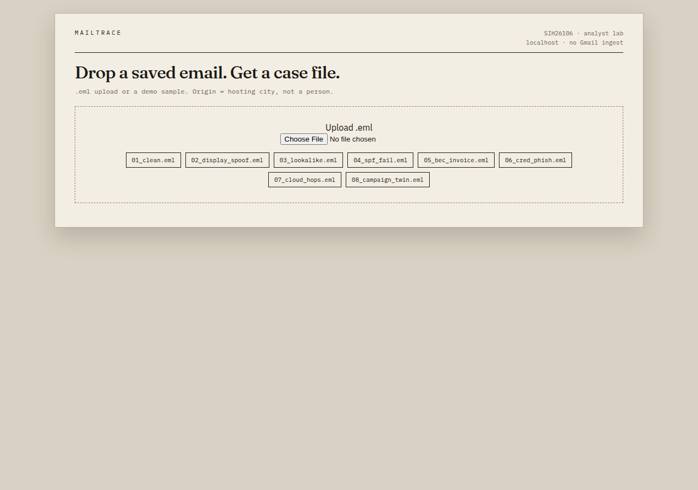
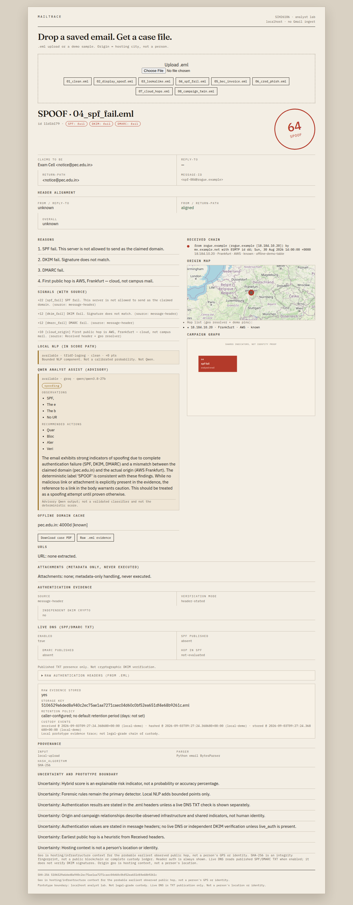
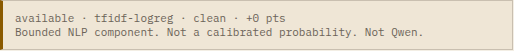
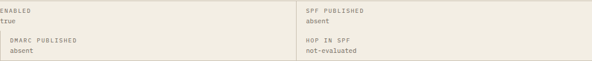
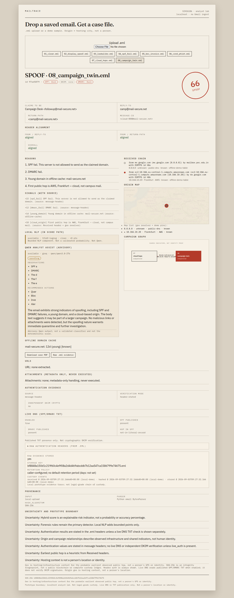
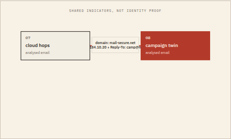
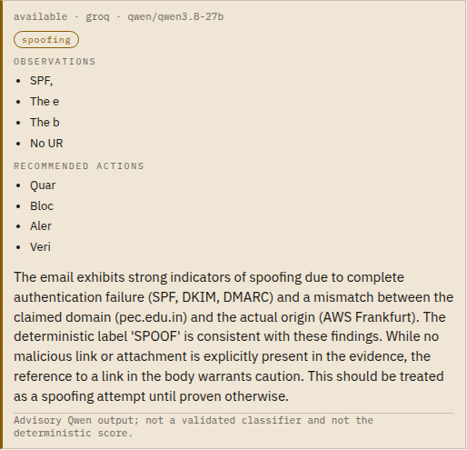
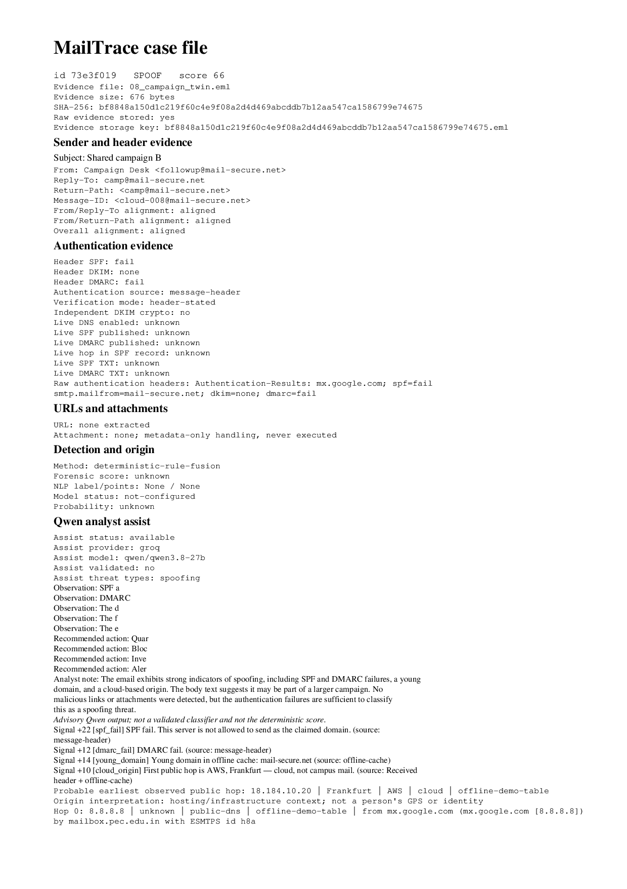
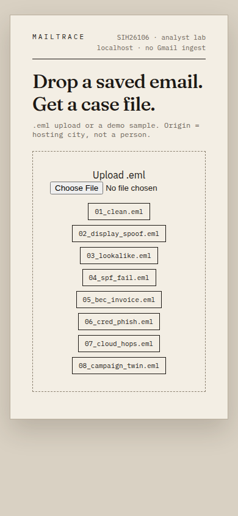

# MailTrace — Complete Noob-Friendly Guide (SIH26106)

> If you know nothing about email security, start here. What we built, every term, screenshot proofs from the **latest** UI (NLP + live DNS + GeoIP), and **how to run it on your own Windows PC from GitHub**.

**Repo (private):** https://github.com/nexurlabs/sih  
**Live full build (private):** https://nexurlabs.com/mailtrace-private/  
**Local:** http://127.0.0.1:8777 after you start uvicorn (see section 4)

Screenshots in `docs/shots/explainer/` were recaptured from live v0.3.0 on **3 Sep 2026**.

---

## 1. What is MailTrace in one minute?

MailTrace is a **detective table for suspicious emails**.

You give it a saved email file (`.eml`). It tells you:

1. **Is it shady?** — score 0-100 + label: `CLEAN`, `SPOOF`, `PHISH`, or `BEC`
2. **Why?** — plain reasons like "SPF fail", "Reply-To does not match From"
3. **Where did it travel?** — the `Received` hop chain + probable first public hop
4. **Is it part of a campaign?** — graph linking emails with same Reply-To / domain / hop
5. **Proof?** — SHA-256 hashed evidence + downloadable PDF case file

It is **not** Gmail. It does not read your inbox. It does not send phishing. It does not track humans.

Think: **post-mortem lab, not spam filter.**

---

## 2. Why did we build this?

Problem statement **SIH26106** basically asks:

> "Anyone can fake an email. Help an investigator prove it, explain it, and link related attacks."

Real pain:

- A student gets "Exam Cell <notice@pec.edu.in>" but it actually came from `rogue.example`. Fees / passwords get stolen.
- A "vendor" sends "new bank account, wire urgently" — that's BEC.
- Normal spam filters just say "spam / not spam". They don't show **why**, **where it came from**, or **whether 5 other mails are the same gang**.

So we built an **explainable, laptop-first analyst lab**. Zero Gmail access required.

---

## 3. What it is NOT (say this to judges)

- Not a 99% spam/ham ML classifier
- Not Gmail / Outlook integration
- Not a human tracker — Geo = **server city / ISP**, never a person's GPS
- Not a DKIM crypto verifier — we read header stamps + live SPF/DMARC TXT
- Not legal chain-of-custody, not "we found the attacker"
- Score is a **risk indicator**, not a probability

---

## 4. Run it on your own Windows PC (from GitHub)

You do **not** need the IBM VM. You clone the private repo and run it locally.

### A. One-time installs

1. Get **invited** to https://github.com/nexurlabs/sih (it is **private**). If GitHub says "not found", you were not invited.
2. Install **Python 3.11 or 3.12** from https://www.python.org/downloads/windows/  
   On the installer, tick **Add python.exe to PATH**. Then close any old terminals and open a new PowerShell.
3. Install **Git** from https://git-scm.com/download/win (Next, Next, Next). Or use GitHub Desktop.

Check Python:

```powershell
python --version
```

If that says "not recognized", PATH was not ticked. Reinstall Python and tick the box.

### B. Clone

```powershell
cd $HOME\Desktop
git clone https://github.com/nexurlabs/sih.git
cd sih
```

GitHub Desktop: **File → Clone repository → nexurlabs/sih**.

### C. Virtual env (do not skip)

```powershell
python -m venv .venv
.\.venv\Scripts\Activate.ps1
```

If PowerShell blocks scripts:

```powershell
Set-ExecutionPolicy -Scope CurrentUser RemoteSigned
```

Then Activate again. You should see `(.venv)` on the left.

CMD: `.venv\Scripts\activate.bat`

### D. Install, test, start

```powershell
pip install -r requirements.txt
python scripts\write_samples.py
pytest -q
python -m uvicorn app:app --host 127.0.0.1 --port 8777
```

**Leave that window open.** Open Chrome/Edge → **http://127.0.0.1:8777**

Or, after Activate: `.\run.ps1`

Stop later with **Ctrl+C**.

If NLP artifacts are missing:

```powershell
python scripts\train_nlp.py
```

### E. How to use the app (the actual clicks)

1. Click **04_spf_fail.eml** → **64 / SPOOF**. Point at SPF/DKIM/DMARC fail and Frankfurt (**hosting**, not a person).
2. Click **01_clean.eml** → **8 / CLEAN**.
3. Click **07_cloud_hops.eml** then **08_campaign_twin.eml** → two nodes, one edge.
4. Scroll: **Local NLP**, **Live DNS**, origin map, evidence hash, **Download case PDF**.
5. Optional: upload a real `.eml` (Gmail → ⋮ → Show original → Download).

### Optional: live DNS + GeoIP + Qwen

Windows does not auto-load `.env` unless you use Git Bash `./run.sh` or `.\run.ps1` after creating `.env`. Easiest in PowerShell **before** uvicorn:

```powershell
$env:MAILTRACE_LIVE_DNS="1"
$env:MAILTRACE_LIVE_GEO="1"
python -m uvicorn app:app --host 127.0.0.1 --port 8777
```

`.mmdb` files are **gitignored**. Demo IPs still pin Frankfurt. For random IPs, put `GeoLite2-City.mmdb` in `data/` (ask a teammate; do not commit).

Qwen is optional. Score works without it:

```powershell
python scripts\set_groq_key.py
```

### Mac / Linux / Git Bash

```bash
python3 -m venv .venv
source .venv/bin/activate
pip install -r requirements.txt
python scripts/write_samples.py
pytest -q
python3 -m uvicorn app:app --host 127.0.0.1 --port 8777
```

### Do not

- Connect Gmail / Outlook
- Send phishing
- Claim you located a person
- Commit `.env`, Groq keys, or `.mmdb`
- Make this repo public

---

## 5. Screenshot proofs (latest UI)

Landing + sample list:



SPF-fail case (full dossier: NLP, Qwen, Frankfurt map, live DNS, evidence):



Local NLP in the score path:



Live DNS (pec.edu.in SPF/DMARC **absent** — honest):



Campaign graph linking 07 + 08:



Graph close-up:



Qwen advisory (never changes score):



PDF report export:



Mobile:



All 8 fixtures:

| file | score | label | what it teaches |
|---|---|---|---|
| 01_clean.eml | 8 | CLEAN | normal mail, aligned auth |
| 02_display_spoof.eml | 100 | SPOOF | Gmail wearing official title |
| 03_lookalike.eml | 98 | PHISH | paypa1-style lookalike + login lure |
| 04_spf_fail.eml | 64 | SPOOF | server not allowed to send as pec.edu.in |
| 05_bec_invoice.eml | 100 | BEC | urgent wire / new bank account language |
| 06_cred_phish.eml | 100 | PHISH | verify password + urgency |
| 07_cloud_hops.eml | 66 | SPOOF | first hop is cloud, not campus |
| 08_campaign_twin.eml | 66 | SPOOF | twin of 07, graph links them |

---

## 6. Stack (what we coded in)

| Piece | What | Why |
|---|---|---|
| Language | **Python 3.11+** | email + tests + sklearn |
| API | **FastAPI** (`app.py`) | `/api/analyze`, health, PDF |
| Parser | stdlib `email` + `mailtrace/parse.py` | headers, body, URLs, attachment metadata |
| Score | `mailtrace/score.py` | explainable; same file → same forensic score |
| NLP | sklearn TF-IDF + LogReg | bounded wording points, local corpus |
| Graph | **NetworkX** | campaign candidates |
| Store | **SQLite** + SHA-256 | laptop, no extra server |
| PDF | **ReportLab** | case file download |
| UI | HTML + JS | no React build |
| Map | Leaflet | tiles optional; hop list always works |
| Geo | MaxMind MMDB | real IPs → city/ISP; demo IPs pinned |
| Live DNS | dnspython | SPF/DMARC TXT when enabled |
| Assist | Groq Qwen | sidebar only |
| Tests | pytest | pins 04=64, 07+08 graph |

---

## 7. Terms explained like you're 10

- **`.eml`** — a saved email file. Gmail: Show original → Download.
- **From / To / Subject** — who claims to send, who receives, title. Easy to fake.
- **Reply-To** — where replies actually go. Scam trick: From says pec.edu.in, Reply-To is gmail.
- **Return-Path** — bounce address. Should match From.
- **Received chain** — every server stamps "I touched this". Read bottom-up. First public hop ≈ probable origin (with uncertainty).
- **SPF** — domain publishes which servers may send as it. Fail = rogue server used the name.
- **DKIM** — signature header. We report the header-stated result. We do not re-check crypto.
- **DMARC** — policy if SPF/DKIM fail.
- **Header-stated vs live DNS** — header-stated = what the .eml already says. Live DNS = we query TXT for SPF and `_dmarc`.
- **Lookalike domain** — paypa1 vs paypal.
- **BEC** — urgent wire / new bank account. Pressure, often no malware.
- **Phish** — steal a password. Verify / login / suspended.
- **Spoof** — fake sender identity.
- **Score 0-100** — risk meter. Starts at 8, adds points. 64 is not "64% sure".
- **NLP** — local wording model. Adds a few bounded points. Not Qwen.
- **Qwen / Groq** — optional notes. Never changes the stamp.
- **GeoIP** — IP → city/ISP of a **mail server**. Not GPS of a person.
- **Campaign graph** — dots = emails, line = shared Reply-To / domain / hop. Not "same person".
- **SHA-256** — fingerprint of the exact uploaded bytes.

---

## 8. One email through the pipeline (04)

```text
.eml bytes
 → parse_eml
 → offline WHOIS cache
 → live SPF/DMARC TXT (optional)
 → fuse (base 8 + SPF 22 + DKIM 12 + DMARC 12 + cloud … = 64)
 → label SPOOF
 → NLP bounded points
 → Qwen note (advisory)
 → SQLite + SHA-256
 → NetworkX graph
 → PDF on demand
```

Why 64 not 100? No password lure, no invoice language, no lookalike. Honest: bad auth, not a credential trap.

---

## 9. Two-minute demo script

1. "This is MailTrace. Offline email forensics. No Gmail."
2. Open 04 → 64 SPOOF. SPF/DKIM/DMARC fail, Frankfurt hop (hosting, not a person).
3. Open 01 → 8 CLEAN.
4. 07 then 08 → two nodes, one edge. Campaign candidate.
5. Evidence / PDF → hashed original bytes.
6. Close: "Rules decide. NLP adds a bit. Qwen only explains. Geo is a server."

---

## 10. Limits to say out loud

Crafted demo `.eml`s. Offline WHOIS cache. No DKIM crypto verify. NLP uncalibrated. `pec.edu.in` currently has no SPF TXT (live DNS says absent — that's a real finding). No mailbox gateway, no quarantine, no "we geolocated a human."

That's the whole product. If they can clone, start uvicorn, click 04, then 07+08, they can present it without you in the room.
